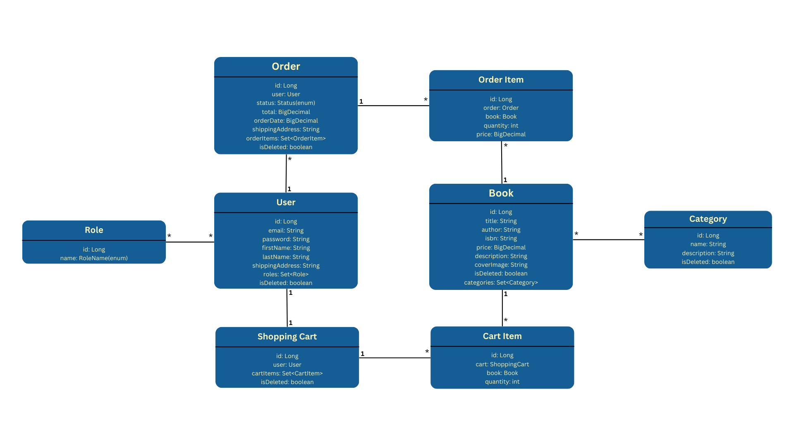

# Dream Books
This project is an API for managing and using bookshop. 
As an admin you can manage state of your bookshop like adding/updating/removing books 
and categories(genres) and as a user you can look for books, adding them to your shopping cart and 
creating orders based on your shopping cart.

## Technology stack
- **Java 21**
- **Database**: Hibernate 6.6.2, MySQL 9.1.0
- **Spring 3.4.0**: Spring Core, Spring Web, Spring Security, Spring Data
- **Web Development**: Tomcat 10.1.33, JSON
- **Tools**: JUnit 5, Maven 3.9.9, Liquibase 4.29.2, Mockito 5.14.2, Test containers 1.20.4, 
Docker 27.3.1, Swagger 2.2.25

## Launch instructions
After [cloning](https://github.com/ihorromaniuk/bookstore.git) this project on your machine the 
only requirement is to have running docker, but first you need to create .env file in the root
folder of this project to specify docker ports, local ports and info for database the project 
will be running with (database is pulled from DockerHUB so there is no need for you to install 
it locally), example of .env file: 
```dotenv
MYSQL_USER=mysql_user
MYSQL_PASSWORD=mysql1234
MYSQL_DATABASE=bookstore
MYSQL_LOCAL_PORT=3307
MYSQL_DOCKER_PORT=3306

MYSQL_ROOT_PASSWORD=root1234

SPRING_LOCAL_PORT=8081
SPRING_DOCKER_PORT=8080
DEBUG_PORT=5005
```
in terminal navigate to the root folder of this project and use command
```console
docker build . -t dream-books-app
```
to build docker image of this project.

Then run this command to start docker containers (pulled database and app from recently
created image) :
```console
docker-compose up
```
default docker server URI is http://localhost:8081, you can specify it in recently created .env 
file.

If you want to run project locally then you also need to have installed Java 21+ version and 
Maven 3.9.9+ version (database is still pulled from DockerHUB), default server URI in this case 
is http://localhost:8080

## Functionality (endpoints)
After you start an application, by default you will have registered admin user with credentials:
```json
{
 "email": "admin@example.com",
 "password": "12345678"
}
```

**\*server URI*** /swagger-ui/index.html - Swagger documentation URL to visit in your browser to 
get full information about endpoints
### Non authenticated users endpoints
- POST: /api/auth/register - register new user
- POST: /api/auth/login - authenticate(login)
### Admin endpoints
#### Books
- POST: /api/books/ - create new book
- PUT: /api/books/{id} - update book in database
- DELETE: /api/books/{id} - remove book (soft delete)
#### Categories
- POST: /api/categories - create new category
- PUT: /api/categories/{id} - update category in database
- DELETE: /api/categories/{id} - remove category (soft delete)
### User endpoints
#### Books
- GET: /api/books - get list of available books
- GET: /api/books/{id} - get specific book
- POST: /api/books/search - get filtered list of books
#### Categories
- GET: /api/categories - get list of available categories
- GET: /api/categories/{id} - get specific category
- GET: /api/categories/{id}/books - get books filtered by category
#### Shopping Cart
- GET: /api/cart - get current state of your shopping cart
- POST: /api/cart - add item to your shopping cart
- PUT: /api/cart/items/{cartItemId} - update item in your shopping cart
- DELETE: /api/cart/items/{cartItemId} - remove item from your shopping cart
#### Order
- POST: /api/orders - create an order from your shopping cart
- GET: /api/orders - get list of your orders
- GET: /api/orders/{orderId}/items - get list of items in specific order
- GET: /api/orders/{orderId}/items/{itemId} - get info about specific order item
## Database Schema

## Postman Collection
In Postman, you can import .json [file](BookStore.postman_collection.json) from the root of this
project to easily start working with all the endpoints this project has (use [api_url]() postman 
collection variable to specify server URI for all endpoints).